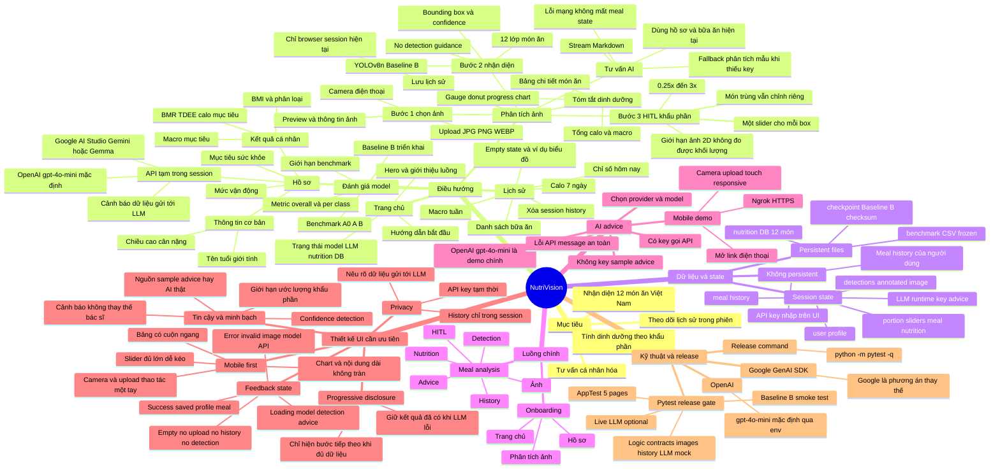
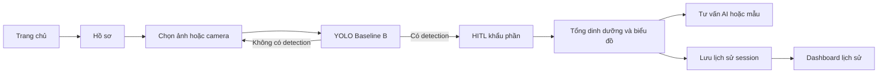

# NutriVision Mind Map

## UI Flow Tóm Tắt

## Ràng Buộc Thiết Kế

- Không yêu cầu API key để hoàn thành luồng demo; dùng sample advice có nhãn khi thiếu key.
- Không để AI tự quyết định khẩu phần; người dùng luôn chỉnh được từng detection.
- Không lưu history hoặc API key sang phiên trình duyệt khác.
- Tối ưu các trạng thái `empty`, `loading`, `error` và `success` trước khi thêm hiệu ứng trang trí.
